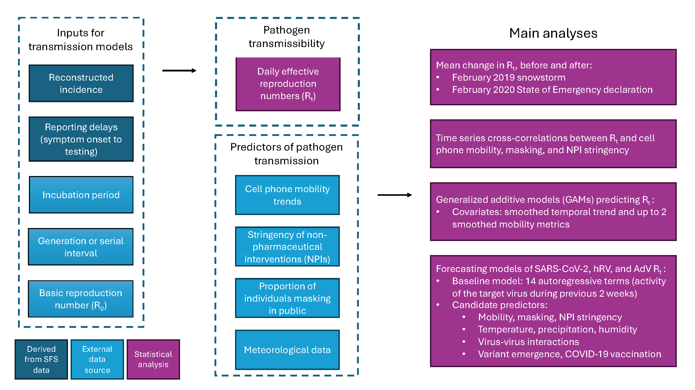

# seattle_mobility_rt
Code and data to reproduce the results and figures in Perofsky _et al._ 2023. "Impacts of human mobility on the citywide transmission dynamics of 18 respiratory viruses in pre- and post-COVID-19 pandemic years." [Preprint](https://doi.org/10.1101/2023.10.31.23297868)

Corresponding author: Amanda Perofsky (acperof@uw.edu)

## Abstract

Many studies have used mobile device location data to model SARS-CoV-2 dynamics, yet relationships between mobility behavior and endemic respiratory pathogens are less understood. We studied the effects of population mobility on the transmission of 16 endemic viruses and SARS-CoV-2 in Seattle over a 4-year period, 2018-2022. Before 2020, visits to schools and daycares, within-city mixing, and visitor inflow preceded or coincided with seasonal outbreaks of endemic viruses. Pathogen circulation dropped substantially after the initiation of COVID-19 stay-at-home orders in March 2020. During this period, mobility was a positive, leading indicator of transmission of all endemic viruses and lagging and negatively correlated with SARS-CoV-2 activity. Mobility was briefly predictive of SARS-CoV-2 transmission when restrictions relaxed but associations weakened in subsequent waves. The rebound of endemic viruses was heterogeneously timed but exhibited stronger, longer-lasting relationships with mobility than SARS-CoV-2. Overall, mobility is most predictive of respiratory virus transmission during periods of dramatic behavioral change and at the beginning of epidemic waves.

## Software and Hardware
Data processing and statistical analyses are performed with the statistical computing software [R](https://www.r-project.org/) version 4.3, unless otherwise noted.

R code was tested on a 2021 MacBook Pro Apple M1 Max with 10 cores and 32GB RAM.
```
> sessionInfo()
R version 4.3.1 (2023-06-16)
Platform: aarch64-apple-darwin20 (64-bit)
Running under: macOS Sonoma 14.4
```

 We used the National Institutes of Health's [Biowulf HPC cluster](https://hpc.nih.gov/) to fit transmission models and perform block bootstrapping of time series cross-correlations. The NIH Biowulf cluster is a 95,000+ core/30+ PB Linux cluster. Biowulf is designed for large numbers of simultaneous jobs common in the biosciences. [Information about Biowulf's hardware](https://hpc.nih.gov/systems/hardware.html). Biowulf used R version 4.2 at the time the code was originally written.

## Dependencies

This project uses `renv` to store its package dependencies. Use the following code snippet to install the specific versions of the R packages used in this study: 
```
install.packages("renv") # if renv is not already installed
renv::restore() #install the specific package versions recorded in the lockfile (renv.lock)
```

## Analyses are split into 6 folders: 

* `1_Seattle_Mobility_Data`: Create cell phone mobility datasets for King County, WA. Combine mobility data with data on masking and the stringency of non-pharmaceutical interventions (NPIs). See README file within the folder for more details.

* `2_Epidemia_Models`: Use semi-mechanistic epidemiological models to estimate respiratory virus daily effective reproduction numbers (Rt). The README file within the folder includes details concerning the specific analyses and directions for how to run transmission models on the NIH Biowulf cluster.

* `3_Combine_Mobility_and_Rt_data`: Combine mobility and Rt datasets into one data frame.

* `4_Block_Bootstrap_Mobility_vs_Rt`: Estimate time series cross-correlations between pathogen Rt and mobility metrics. The README file within the folder includes details concerning the specific analyses and directions for how to run block-bootstrapped cross-correlations on the NIH Biowulf cluster.

* `5_Mobility_Rt_GAMs`: Fit generalized additive models (GAMs) to pathogen Rt estimates, with a smoothed temporal trend and up to 2 smoothed mobility metrics as covariates. See README file within the folder for more details.

* `6_LASSO_Predictive_Models` : Use moving window LASSO regression models to produce short-term forecasts of rhinovirus, adenovirus, and SARS-CoV-2 Rt. Model covariates include the activity of the target virus during the previous 2 weeks (14 autoregressive terms), cell phone mobility trends, the co-circulation of other viruses, and climatic data. Compare prediction accuracy across models with different combinations of covariates. The README file within the folder includes more details about model inputs.

**An overview of statistical analyses and their various inputs.**
<figure>

</figure>

## Data Availability

Processed pathogen incidence data from the Seattle Flu Study are provided in the `2_Epidemia_Models/Epidemia_Models_Biowulf/` folder. To reconstruct incidences, we adjusted Seattle Flu Study RT-PCR pathogen presence/absence data by total test volume, age, clinical setting, and local syndromic respiratory illness rates.

Access to de-identified individual-level study participant data requires a signed data access agreement with the Seattle Flu Alliance and can be made available to researchers whose proposed use of the data is approved by study investigators. Requests for data access should be submitted to data@seattleflu.org. Aggregated influenza syndromic and virologic surveillance data for Washington state are publicly accessible through the [US CDC FluView Interactive](https://www.cdc.gov/flu/weekly/fluviewinteractive.htm) dashboard. Aggregated respiratory syndromic surveillance data for King County, WA are not publicly available and were provided by the Washington Department of Health's Rapid Health Information Network (RHINO) program. Access for research purposes requires a signed data sharing agreement with WA DOH and exemption approval from the Washington State Institutional Review Board. Requests for data access should be submitted to RHINO@doh.wa.gov.  Data on confirmed COVID-19 cases in King County, WA are publicly accessible through the [WA DOH COVID-19 dashboard](https://doh.wa.gov/emergencies/covid-19/data-dashboard).

Some mobility metrics were generated using SafeGraph Weekly Patterns and Social Distancing datasets, which were originally made freely available to academics in response to the COVID-19 pandemic. The SafeGraph Weekly Patterns dataset is currently available to academics for non-commercial use through an institutional university subscription or individual subscription to [Dewey](https://www.deweydata.io/). The data access agreement with Dewey does not permit sharing of the raw data. Meta Data for Good Movement Range Maps are publicly accessible through the [Humanitarian Data Exchange](https://data.humdata.org/dataset/movement-range-maps). [SafeGraph social distancing data](https://docs.safegraph.com/docs/social-distancing-metrics) and US county-level survey data on masking are publicly accessible through the [Delphi COVIDcast Epidata API](https://cmu-delphi.github.io/delphi-epidata/api/covidcast.html). Data on the stringency of non-pharmaceutical interventions in US states are publicly accessible through the [Oxford COVID-19 Government Response Tracker](https://github.com/OxCGRT/covid-policy-tracker).


### Inputs for forecasting models
Data on COVID-19 vaccination in King County, WA are publicly accessible through the [Public Health – Seattle & King County COVID-19 Vaccination dashboard](https://kingcounty.gov/en/dept/dph/health-safety/disease-illness/covid-19/data/vaccination). Nextstrain-curated SARS-CoV-2 sequence metadata from GISAID can be downloaded via the [nextstrain-cli tool](https://docs.nextstrain.org/projects/cli/en/stable/). Daily records of precipitation, average wet bulb temperature, and average relative humidity in Seattle, WA are publicly accessible through the NOAA NCEI [U.S. Local Climatological Database](https://www.ncei.noaa.gov/products/land-based-station/local-climatological-data).
